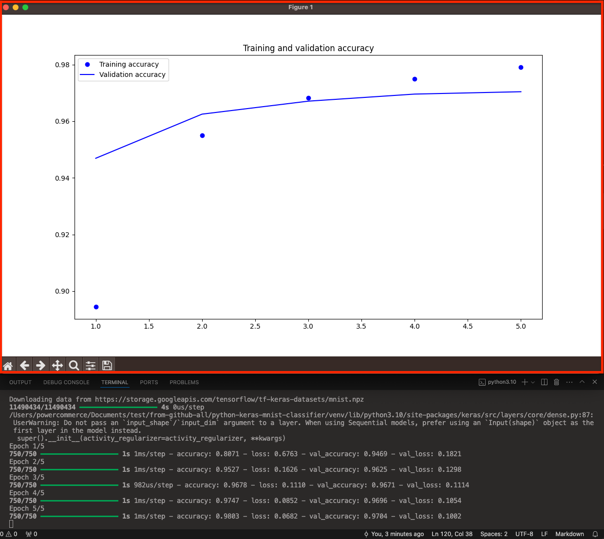
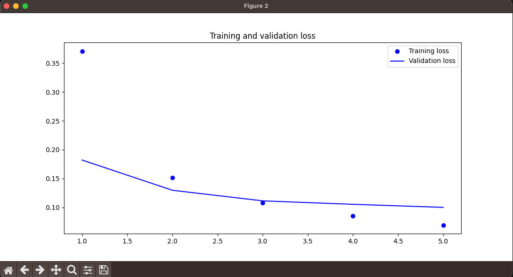

# &#x1F6A9; Python : Keras (hight-level neural networks API) with dataset MNIST

&nbsp;

**Deep learning for humans.** 
Keras is an API designed for human beings, not machines. Keras follows best practices for reducing cognitive load: it offers consistent & simple APIs, it minimizes the number of user actions required for common use cases, and it provides clear & actionable error messages. Keras also gives the highest priority to crafting great documentation and developer guides.

&nbsp;

Reference :  
- Documentations | Keras
  <pre>https://keras.io/</pre>

&nbsp;

&nbsp;

---

&nbsp;

## &#x1F530; Project

Dalam project ini, kita akan membuat dan melatih sebuah model jaringan saraf tiruan sederhana untuk melakukan klasifikasi gambar menggunakan dataset MNIST, yang terdiri dari gambar-gambar angka tulisan tangan.

<i>In this project, we will build and train a simple artificial neural network model to perform image classification using the MNIST dataset, which consists of handwritten numeric images.</i>

&nbsp;

&nbsp;

## &#x1F530; Begin : 

Creating Directories and File Structures
<pre>
  ❯ pwd
      /Users/.../&lt;project-name&gt;

  ❯ cd &lt;project-name&gt;

  ❯ python -m venv venv

  ❯ source ./venv/bin/activate

  ❯ pip install -r requirements.txt

  ❯ mkdir -p data models utils

  ❯ touch data/__init__.py data/data_loader.py

  ❯ touch models/__init__.py models/neural_network.py

  ❯ touch utils/__init__.py utils/helper_functions.py

  ❯ touch train.py predict.py

  ❯ tree -L 2 -a -I 'README.md|.DS_Store|.git|.gitignore|venv' ./
    ./
    ├── data
    │   ├── __init__.py
    │   └── data_loader.py
    ├── models
    │   ├── __init__.py
    │   └── neural_network.py
    ├── predict.py
    ├── train.py
    └── utils
        ├── __init__.py
        └── helper_functions.py

    3 directories, 8 files
</pre>

&nbsp;

<pre>
  ❯ pip list
  Package                      Version
  ---------------------------- -----------
  absl-py                      2.1.0
  astunparse                   1.6.3
  certifi                      2024.2.2
  charset-normalizer           3.3.2
  contourpy                    1.2.1
  cycler                       0.12.1
  flatbuffers                  24.3.25
  fonttools                    4.51.0
  gast                         0.5.4
  google-pasta                 0.2.0
  grpcio                       1.63.0
  h5py                         3.11.0
  idna                         3.7
  keras                        3.3.3
  kiwisolver                   1.4.5
  libclang                     18.1.1
  Markdown                     3.6
  markdown-it-py               3.0.0
  MarkupSafe                   2.1.5
  matplotlib                   3.9.0
  mdurl                        0.1.2
  ml-dtypes                    0.3.2
  namex                        0.0.8
  numpy                        1.26.4
  opt-einsum                   3.3.0
  optree                       0.11.0
  packaging                    24.0
  pillow                       10.3.0
  pip                          22.0.4
  protobuf                     4.25.3
  Pygments                     2.18.0
  pyparsing                    3.1.2
  python-dateutil              2.9.0.post0
  requests                     2.31.0
  rich                         13.7.1
  setuptools                   58.1.0
  six                          1.16.0
  tensorboard                  2.16.2
  tensorboard-data-server      0.7.2
  tensorflow                   2.16.1
  tensorflow-io-gcs-filesystem 0.37.0
  termcolor                    2.4.0
  typing_extensions            4.11.0
  urllib3                      2.2.1
  Werkzeug                     3.0.3
  wheel                        0.43.0
  wrapt                        1.16.0
</pre>

&nbsp;

&nbsp;

## &#x1F530; Codes : 

<pre>
  ❯ vim data/data_loader.py
</pre>
<pre>
  import numpy as np
  from keras.datasets import mnist
  from keras.utils import to_categorical

  def load_mnist_data():
      (train_images, train_labels), (test_images, test_labels) = mnist.load_data()
      
      train_images = train_images.reshape((60000, 28 * 28)).astype('float32') / 255
      test_images = test_images.reshape((10000, 28 * 28)).astype('float32') / 255
      
      train_labels = to_categorical(train_labels)
      test_labels = to_categorical(test_labels)
      
      return (train_images, train_labels), (test_images, test_labels)
</pre>

&nbsp;

<pre>
  ❯ vim models/neural_network.py
</pre>
<pre>
  from keras.models import Sequential
  from keras.layers import Dense

  def create_neural_network():
      model = Sequential()
      model.add(Dense(64, activation='relu', input_shape=(28 * 28,)))
      model.add(Dense(64, activation='relu'))
      model.add(Dense(10, activation='softmax'))
      
      return model
</pre>

&nbsp;

<pre>
  ❯ vim utils/helper_functions.py
</pre>
<pre>
import matplotlib.pyplot as plt

def plot_training_history(history):
    acc = history.history['accuracy']
    val_acc = history.history['val_accuracy']
    loss = history.history['loss']
    val_loss = history.history['val_loss']
    
    epochs = range(1, len(acc) + 1)
    
    plt.plot(epochs, acc, 'bo', label='Training accuracy')
    plt.plot(epochs, val_acc, 'b', label='Validation accuracy')
    plt.title('Training and validation accuracy')
    plt.legend()
    
    plt.figure()
    
    plt.plot(epochs, loss, 'bo', label='Training loss')
    plt.plot(epochs, val_loss, 'b', label='Validation loss')
    plt.title('Training and validation loss')
    plt.legend()
    
    plt.show()
</pre>

&nbsp;

<pre>
  ❯ vim train.py
</pre>
<pre>
  from data.data_loader import load_mnist_data
  from models.neural_network import create_neural_network
  from utils.helper_functions import plot_training_history

  (train_images, train_labels), (test_images, test_labels) = load_mnist_data()

  model = create_neural_network()
  model.compile(optimizer='adam', loss='categorical_crossentropy', metrics=['accuracy'])

  history = model.fit(train_images, train_labels, epochs=5, batch_size=64, validation_split=0.2)

  plot_training_history(history)

  model.save('mnist_model.h5')
</pre>

&nbsp;

<pre>
  ❯ vim predict.py
</pre>
<pre>
  import numpy as np
  from keras.models import load_model
  from data.data_loader import load_mnist_data

  (train_images, train_labels), (test_images, test_labels) = load_mnist_data()

  model = load_model('mnist_model.h5')

  # Prediksi label untuk beberapa gambar uji
  predictions = model.predict(test_images[:5])

  # Tampilkan prediksi dan label sebenarnya
  for i, prediction in enumerate(predictions):
      predicted_label = np.argmax(prediction)
      actual_label = np.argmax(test_labels[i])
      print(f'Predicted: {predicted_label}, Actual: {actual_label}')
</pre>

&nbsp;

&nbsp;

---

&nbsp;

## &#x1F530; Run

Run the train.py file to train the model. You can do this by typing python3 train.py in the terminal.

<pre>
  ❯ python3 train.py
</pre>

    

 

&nbsp;

    

 

&nbsp;

Once the training is complete, the model will be saved in the file `mnist_model.h5` in the same directory.

<pre>
  ❯ tree -L 2 -a -I 'README.md|.DS_Store|.git|.gitignore|venv|gambar-petunjuk' ./
    ./
    ├── data
    │   ├── __init__.py
    │   ├── __pycache__
    │   └── data_loader.py
    ├── mnist_model.h5
    ├── models
    │   ├── __init__.py
    │   ├── __pycache__
    │   └── neural_network.py
    ├── predict.py
    ├── requirements.txt
    ├── train.py
    └── utils
        ├── __init__.py
        ├── __pycache__
        └── helper_functions.py

    6 directories, 10 files

  ❯ find ./ -type f -name "*.h5" | sed 's/[^\/]*\//|   /g;s/| *\([^| ]\)/+--- \1/'
    |   +--- mnist_model.h5
    |   |   |   |   |   |   |   |   +--- vlen_string_s390x.h5
    |   |   |   |   |   |   |   |   +--- vlen_string_dset_utc.h5
    |   |   |   |   |   |   |   |   +--- vlen_string_dset.h5
</pre>

&nbsp;

&nbsp;

## Result :

Run the predict.py file to make predictions with the trained model. Type python3 predict.py in the terminal.
<pre>
  ❯ python3 predict.py
    WARNING:absl:Compiled the loaded model, but the compiled metrics have yet to be built. `model.compile_metrics` will be empty until you train or evaluate the model.
    1/1 ━━━━━━━━━━━━━━━━━━━━ 0s 56ms/step
    Predicted: 7, Actual: 7
    Predicted: 2, Actual: 2
    Predicted: 1, Actual: 1
    Predicted: 0, Actual: 0
    Predicted: 4, Actual: 4
</pre>

&nbsp;

&nbsp;

&nbsp;

&nbsp;

---

&nbsp;

    

 

&nbsp;

---

&nbsp;

&nbsp;

&nbsp;